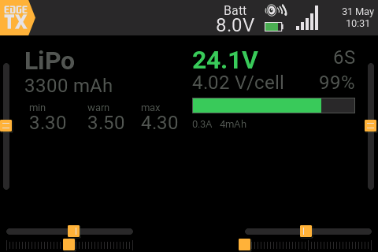
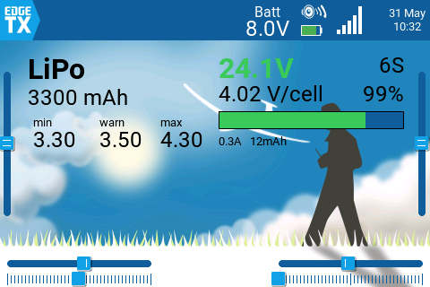
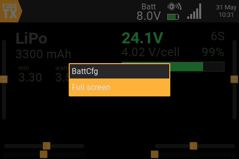
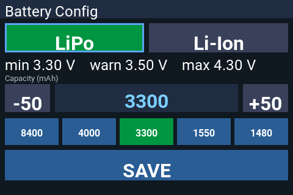
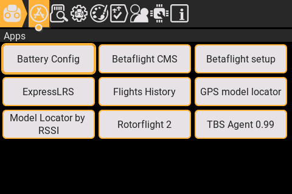
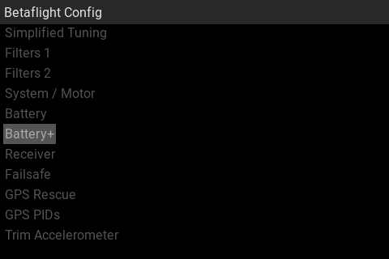
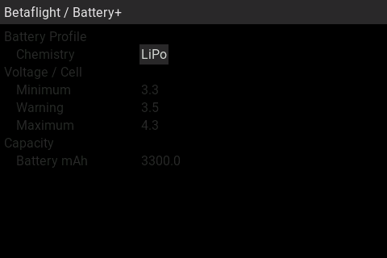

# Battery tools for Betaflight on EdgeTX color/touch radios

A small collection of Lua add-ons that make changing and viewing your Betaflight
battery setup fast on color touchscreen radios (developed and tested on a
**RadioMaster TX15**, EdgeTX). It is intended to complement the official
[betaflight-tx-lua-scripts](https://github.com/betaflight/betaflight-tx-lua-scripts).

There are four pieces, all independent — install only what you want:

| Item | What it is | Path on SD card | Needs the BF Lua scripts? |
|------|------------|-----------------|---------------------------|
| **BattView** widget | Live battery telemetry on the home screen (voltage, cell count, %/cell, charge gauge, current, mAh) | `WIDGETS/BattView/main.lua` | No — telemetry only |
| **BattCfg** widget | Quick battery *config* on the home screen; hold to open a full-screen touch editor | `WIDGETS/BattCfg/main.lua` | Yes |
| **Battery Config** tool | Same full-screen editor, opened from `SYS > Tools` | `SCRIPTS/TOOLS/battcfg.lua` | Yes |
| **Battery+** page | Extra page inside the BF Lua scripts: LiPo/Li-Ion profile switch + capacity | `SCRIPTS/BF/PAGES/battery2.lua` (+ patched `pages.lua`, `COMPILE/scripts.lua`) | Yes (it *is* a BF page) |

> Profiles default to **LiPo** (min 3.30 / warn 3.50 / max 4.30 V/cell) and
> **Li-Ion** (min 3.00 / warn 3.30 / max 4.20 V/cell). Capacity quick picks
> default to `8400 / 4000 / 3300 / 1550 / 1480` mAh with a 50 mAh step.
> Edit the tables near the top of each file to change these.

---

## Screenshots

The widgets follow your EdgeTX theme. Here are both widgets on a dark and a light
theme (left: **BattCfg** config, right: **BattView** live telemetry):

| Dark theme | Light theme |
|------------|-------------|
|  |  |

Opening the **BattCfg** full-screen editor — hold the widget, then pick *Full screen*:

The full-screen editor: tap **LiPo** / **Li-Ion** to apply a profile (saved
immediately), adjust capacity with **-50 / +50** or the quick-pick buttons, then **SAVE**:

The **Battery Config** tool also appears under **SYS → Tools**:

The **Battery+** page inside the Betaflight Lua setup (right after **Battery**):

| In the menu | The page |
|-------------|----------|
|  |  |

---

## Requirements

- A **color, touchscreen** EdgeTX radio (e.g. RadioMaster TX15/TX16S, Jumper T-series, FrSky X-series color).
- EdgeTX recent enough to expose touch events and `lcd.sizeText` (EdgeTX 2.8+; tested on current 2.11).
- For everything except **BattView**: the official
  **betaflight-tx-lua-scripts** installed (the `SCRIPTS/BF/` folder must exist),
  because those tools reuse its MSP layer.
- A Betaflight FC with telemetry enabled and MSP-over-telemetry working
  (the same setup the official BF Lua scripts need).

---

## Installation

All paths are relative to the **root of your radio's SD card**. Folder names
matter: an EdgeTX widget must live in `WIDGETS/<Name>/main.lua`, and the file
must be named exactly `main.lua`.

### BattView widget (live telemetry)
1. Copy `widgets/BattView/` to `WIDGETS/BattView/` on the SD card
   (so you get `WIDGETS/BattView/main.lua`).
2. Restart the radio.
3. On the home screen, edit a widget zone and pick **BattView**.
4. Power the model, then on the radio do **Model → Telemetry → Discover new sensors**
   with the battery connected. Once `RxBt` (or `VFAS`) is discovered, the widget fills in.

Optional widget settings (long-press the widget → *Widget settings*):
`Battery` (force a voltage sensor, 0 = auto), `Cells` (0 = auto),
`MinCell`/`MaxCell` (gauge range in tenths of a volt, e.g. 30 = 3.0 V for Li-Ion).

### BattCfg widget (config on the home screen)
1. Copy `widgets/BattCfg/` to `WIDGETS/BattCfg/`.
2. Restart the radio and add the **BattCfg** widget to a zone.
3. The zone shows the current profile, voltages and capacity.
   **Hold** the widget → **Full screen** to open the touch editor.

### Battery Config tool (from SYS > Tools)
1. Copy `tools/battcfg.lua` to `SCRIPTS/TOOLS/battcfg.lua`.
2. On the radio: **SYS → Tools → Battery Config**. It opens full-screen with
   touch working immediately. A short **RTN** exits.

### Battery+ page (inside the BF Lua scripts)
1. Copy `bf-page/battery2.lua` to `SCRIPTS/BF/PAGES/battery2.lua`.
2. Replace `SCRIPTS/BF/pages.lua` with `bf-page/pages.lua`
   (it adds the *Battery+* menu entry).
3. Replace `SCRIPTS/BF/COMPILE/scripts.lua` with `bf-page/scripts.lua`
   (adds `battery2.lua` to the compile list).
4. Replace `SCRIPTS/BF/COMPILE/scripts_compiled.lua` with `bf-page/scripts_compiled.lua`
   (contains `return false`) **or** delete all `*.luac` files under `SCRIPTS/BF/`.
   This forces a one-time recompile so the new page is picked up.
5. Open the BF Lua tool (`SYS → Tools → Betaflight setup`). It will recompile
   once ("Compiling…"), then **Battery+** appears in the menu right after **Battery**.

> If you only edited `pages.lua` and the new entry does not show up, it's almost
> always because the old compiled `.luac` files are still being used — do step 4.

---

## Usage notes

- **Write only while disarmed.** Betaflight refuses EEPROM writes while the quad
  is armed — this is a safety feature, not a bug.
- The config tools **do not reboot** the FC. Battery settings apply without a reboot.
- Profile auto-detection uses the min cell voltage: ≤ 3.15 V is treated as Li-Ion,
  otherwise LiPo.
- **BattView** colors follow your EdgeTX theme (dark text on light themes, light on
  dark) and don't fill the background, so the widget blends into your home screen.
  The charge gauge stays green/yellow/red regardless of theme.

---

## Safety / disclaimer

These scripts change flight-controller battery configuration. Always verify the
values in the Betaflight Configurator after using them, and never rely solely on
TX-side warnings for battery safety. Use at your own risk. The voltage/capacity
profiles are defaults — adjust them to your own packs.

---

## Credits & license

- Built to work alongside the official
  [betaflight-tx-lua-scripts](https://github.com/betaflight/betaflight-tx-lua-scripts)
  (GPL-3.0). The **Battery+** page and the **BattCfg** widget/tool reuse that
  project's MSP layer (`SCRIPTS/BF/`) and are derivative works of it.
- Accordingly, this repository is released under the **GNU General Public
  License v3.0** (see `LICENSE`).
- Betaflight, EdgeTX and RadioMaster are trademarks of their respective owners.
  This project is not affiliated with or endorsed by them.
